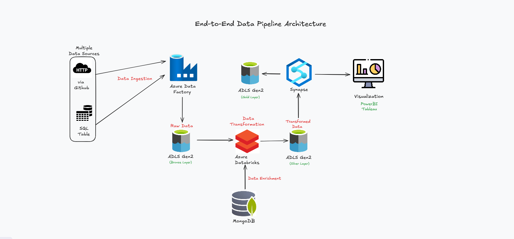
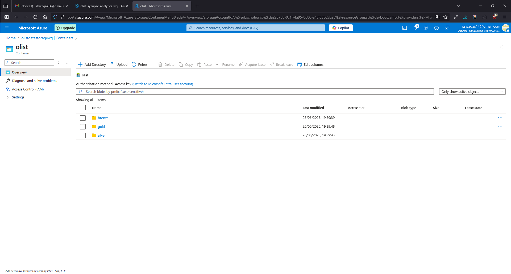
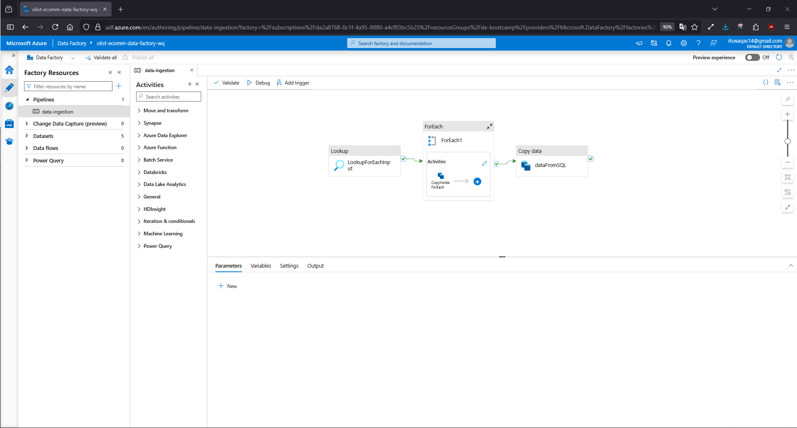
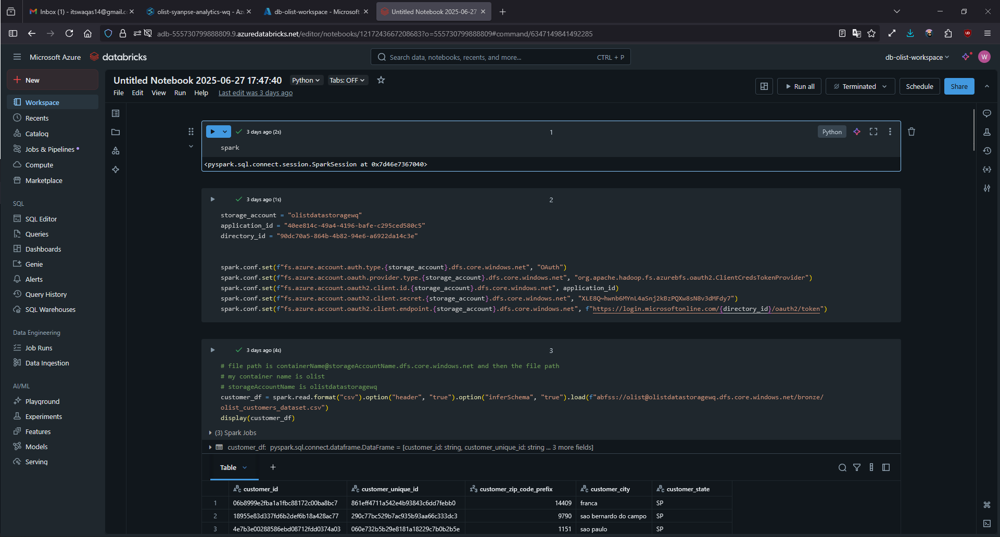
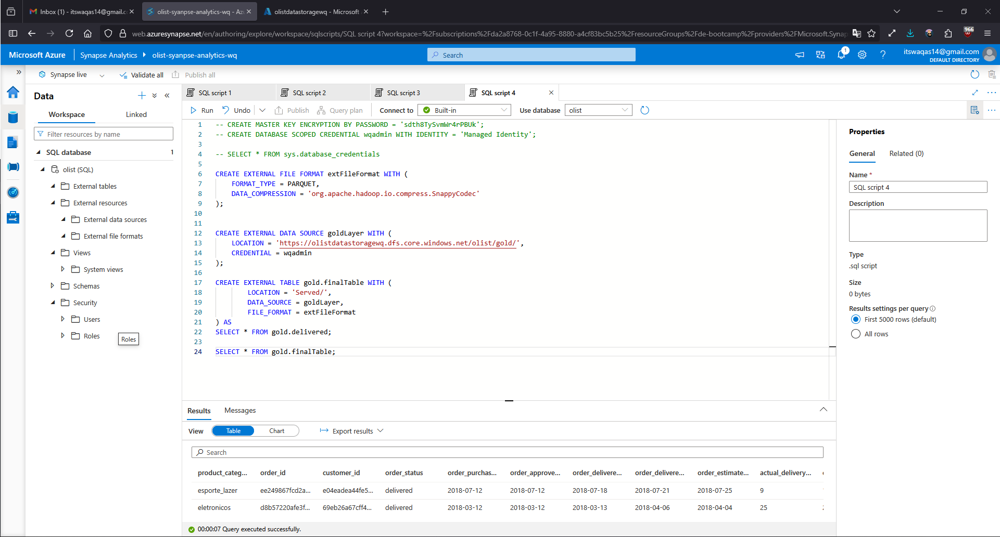
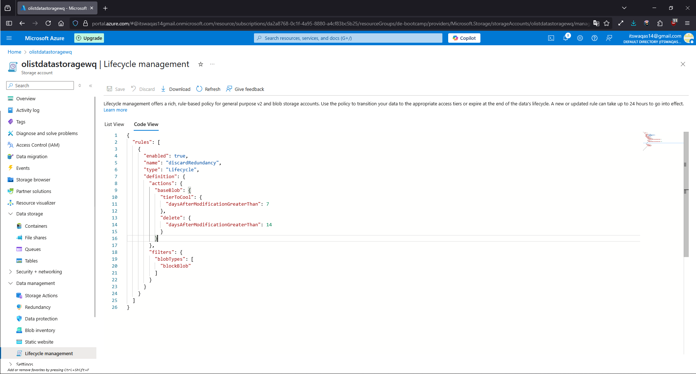

# Azure-end-to-end-pipeline
The goal was to build an end-to-end data pipeline which could be used to import transformed data for analytics purpose in powerbi/tableau or any other data viz software

## Architecture
The system is made up of the following Azure services:
- Azure Data Factory
- Azure Data Lake Storage (ADLS) Gen2
- Azure Databricks
- Azure Synapse Analytics

The flow of data can be understood from the below pipeline:

## Dataset
The project uses the [Olist data](https://www.kaggle.com/datasets/olistbr/brazilian-ecommerce/data). The goal of this project was to imitate the industry data that might you get from multiple sources, so be able to ingest it cleanly into a single source.

## Medallion Architecture
By following standard practices, I have divided the data transformation into three different levels(bronze, silver, gold) following the Medallion architecture
- Bronze: Contains raw data coming from multiple sources
- Silver: Contains the enriched data by joining different datasets to create a comprehensive data and translating some part of the data to match the language using NoSQL
- Gold: Contains the aggregated data. This layer is the serving layer which is used for analytics

## Data Ingestion
Using Azure Data Factory, I created a comprehensive ETL pipeline that ingests raw CSV files from multiple sources into the Bronze layer of ADLS Gen2, using a parameterized ForEach activities to dynamically process files from each source.

## Data Transformation
Using Azure Databricks, I ingested the source data into a single table and applied cleaning and joining before writing the unified result to the silver layer which makes it easier for downstream analytics. Because the primary goal of this project was to design and orchestrate a fully automated end-to-end pipeline, the transformation logic was deliberately kept lightweight.

## Data Serving
Using Azure Synapse Analytics, I created SQL views over gold-layer data and exposed them as external tables for seamless integration with BI tools.

## Lifecycle Policies
By making use of lifecycle policies, I leverage lifecycle policies to cut storage costs by tiering files to cool storage after 7 days of no modifications and deleting them after 14 days of inactivity.

